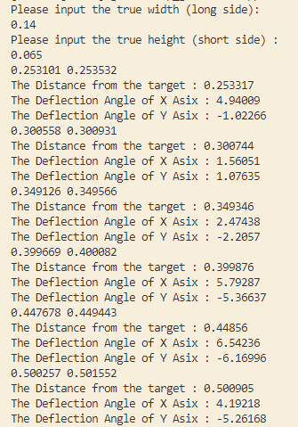

## 2024-02-12 15:30
### 1. FEATURE 新增
无
### 2. CHANGE 变更
#### `V2`

此次在 `V2` 中新增大量神经网络训练模型，并且新增了通过模型预测得到的结果来 **按顺序标注** 并 **计算偏转角度** 的功能。

### 3. FIXED 修复
无

### 4. ILLUSTRATION 说明

1. 这次增加了不少通过yolo训练出来的模型，但是识别的效果还是不够满意。或许是从 `pt` 模型转化成 `onnx` 模型还是有所损失。

2. 由于上面说的识别效果仍待加强，因此此次的程序中其实存在一些让人不太满意的地方，不过用于中期考核因该是没有问题的。

---

## 2024-02-08 23: 20
### 1. FEATURE 新增
#### `ColorPicker` :

C++ 程序，通过获取HSV色域。

#### `V1` :

C++ 程序，本来打算通过 onnx 模型将相机中的所有色块检测出来，然后通过获取检测出来的色块 HSV 阈值来进一步精确的检测色块，但是发现拍出来的照片效果不好，阈值相差太大，无法通过同一的阈值来限定，遂放弃。

#### `V2` : 

C++ 程序，通过 onnx 来获取所有色块及其标签，打算通过模型判断出来的标签来获得检测顺序，但是还没有写完。

### 2. CHANGE 变更
无

### 3. FIXED 修复
无

### 4. ILLUSTRATION 说明

1. 此次使用的 onnx 模型是在 `yolov3-tiny.pt` 预训练模型的基础上训练得到的模型，因此会更加轻量，同时检测效果也几乎相近。

2. `V2` 的程序其实和之前 `Aim` 的程序可以说是相近的，但是目前仍在开发中，打算纯粹通过神经网络来进行瞄准。

---

## 2024-02-06
### 1. FEATURE 新增
#### MachineStructure : 

小车底盘部分：六角联轴器，角码

### 2. CHANGE 变更
无

### 3. FIXED 修复
无

### 4. ILLUSTRATION 说明
未完成，谨慎食用

---

## 2024-02-05 10: 30
### 1. FEATURE 新增
#### `Aim` :

C++ 程序，通过yolov5实现了色块的获取。

### 2. CHANGE 变更
无

### 3. FIXED 修复
无

### 4. ILLUSTRATION 说明

1. `Aim` 程序在 Windows 系统下开发，在 yolov5n 预训练模型上对自己做的数据集训练 1000 轮后得到的模型转为 onnx ，然后利用 OpenCV 的 `DNN` 模块加载该模型并进行推理，获得了能够识别这次比赛中的色块的程序。

2. 但是这次的模型较为庞大，导致实时识别的视频帧率 **不高** ，但是对这次比赛来说够了。不过后续应该重新训练出更轻量的模型，或者将此次训练出来的模型进行量化，或者使用 yolov3，v4 等网络结构来减轻模型的重量。

---

## 2024-01-25 12：05
### 1. FEATURE 新增
#### `SerialControl` :

C++ 程序，实现 Linnux 通过程序与STM32串口进行通信。

#### `SerialMCU` :

C 程序，基于 STM32F103C8T6 芯片开发，实现了在OLED屏幕显示串口传来的具有特定包头包尾的数据包。

#### `SerialPWM` :

C 程序，基于 STM32F103C8T6 芯片开发，实现了根据上位机通过串口传来的数据包来控制舵机旋转，并将此次旋转角度显示在OLED屏幕上。

### 2. CHANGE 变更
无

### 3. FIXED 修复
无

### 4. ILLUSTRATION 说明

1. `SerialControl` 模块在 Linux 系统下开发，通过 CMake 编译，编译后的可执行文件存放于 `build/` 目录下。由于该模块为 **单文件** 模块，~~因此理论上可以直接在 Windows 系统上通过 VSCode 生成可执行文件并运行，但是还没有试过~~。
> 更正：由于使用的是ubuntu的串口，因此Windows下并没有直接的串口相对于，无法直接运行

2. `SerialMCU` 和 `SerialPWM` **不是通过 Keil5 来开发！！！** 而是 **通过 `Embedded IDE` 在 VSCode 上开发** ，并且通过 `openocd` 进行烧录。但是可以在 VSCode 中导出为 Keil5项目。

---

## 2024-01-21 21：45
### 1. FEATURE 新增
#### Calibration : 

Python 和 C++ 混合模块，包括 `shoot` 和 `calibrate`

##### `shoot` 

拍摄并存储用于测量相距的图片

##### `calibrate`

该模块成功根据 **目标的长宽** 以及 **目标离相机镜头的距离** 计算获得 **摄像头的相距** ，并将一些摄像头的内参写入 `param.csv` 文件中，包括：
1. 像元尺寸 `u` 
2. 焦距 `focus`
3. 不同图片计算得到的相距列表 `d_list`
4. 根据列表计算得到的平均相距 `d_avg`
5. 相机使用的分辨率 `w * h` 

### 2. CHANGE 变更
#### GetDistance

更改内部参数，将计算中使用的 **焦距** 改为测得的 **相距**

根据测得的相距来计算距离和偏角，精确度比原本搞了一档，结果如下：

此次测量依次在距离为 0.25m, 0.3m, 0.35m, 0.4m, 0.45m, 0.5m 下进行，可以看到精度已经有所提高，误差控制在 0.5cm 以内

### 3. FIXED 修复
无

### 4. ILLUSTRATION 说明

`Calibration` 在 **Windows** 系统下编写，其中 `shoot` 由 C++ 编写并利用 `CMake` 进行编译，编译后的可执行文件存放于 `build/shoot.exe` ; `calibrate` 由 Python 编写

此次测量的相距为 `杰锐微通 DF-100 2.8mm 90度` 摄像头的相距

在此次试验中，得到的偏角似乎更加精确了，但是并没有实际使用过，接下来应该先将 **串口通信** 解决，然后改用 `PNP` 算法进行 **测距** 和 **算偏角** 

而且到目前为止的工作都是对 **背景干扰少(甚至可以说无背景干扰)** 和 **单个目标** 进行的，需要扩大到比赛时的多目标 

---

## 2024-01-21 16：30
### 1. FEATURE 新增
#### GetAngle : 

C++ 程序，成功根据 **目标** 的长宽以及 **相机的参数** 以及 **目标离相机的大致距离** 获得目标中心离画面中心的 **偏角**。

经过测试，这个偏角貌似挺合理？但是因为没有相应的器件把相机装到舵机上，所以是手动比划，看上去还可以。

该模块合并了前两个模块 `GetDistance` 和 `AutoAimming` 中的函数，具有两个可执行程序，其中：
1. `main` 是单张图片的偏角计算
2. `main2` 用于摄像头按需计算目标偏角，按下 `0` 可以计算按下时离镜头中心的偏角

### 2. CHANGE 变更
#### AutoAimming

修改了一些注释样式

#### GetDistance

修改了一些注释样式

### 3. FIXED 修复
无

### 4. ILLUSTRATION 说明
`GetAngle` 在 **Linux** 系统下编写，并利用 `CMake` 进行编译，编译后的可执行文件存放于 `build/main` 

此次 `GetAngle` 模块由 `杰锐微通 DF-100 2.8mm 90度` 摄像头来完成

此外，今天测试偏角的时候发现测距的函数有偏差，不能忍的偏差，主要原因是对原理的认知有一点点偏差，实际上利用相似的原理测距需要的是 **相距** 而不是 **焦距** ，因此接下来需要标定相机的 **相距**

而且到目前为止的工作都是对 **背景干扰少(甚至可以说无背景干扰)** 和 **单个目标** 进行的，需要扩大到比赛时的多目标 

---

## 2024-01-18
### 1. FEATURE 新增
#### GetDistance : 

C++ 程序，成功根据 **目标** 的长宽以及 **相机的参数** 获得 **目标里相机的大致距离** 

经过 **三次不严谨的测试** ， 该测量准确度 **还行** ， 误差控制在 **3cm/10%** 以内，且此次测试由于距离较短(30cm以内)，误差显得更为突出，预估测量50cm以上的距离效果可能好一点？

同时，在该模块下还有一个用于获取实验数据的 `shoot` 工具，和用于颜色获取的 `pick` 工具(尚未完成)

### 2. CHANGE 变更
#### AutoAimming

新增了 `mathfunc` 模块用于计算偏角，但是目前只有实现获取 **目标中心在相机中的坐标** 的 `getCenter` 这一函数

另外，修改了 `process` 模块中的头文件，使得函数原型更为完整

### 3. FIXED 修复
无

### 4. ILLUSTRATION 说明
`GetDistance` 在 **Linux** 系统下编写，并利用 `CMake` 进行编译，编译后的可执行文件存放于 `build/main` 

此次 `GetDistance` 模块由 `杰锐微通 DF-100 2.8mm 90度` 摄像头来完成

~~不知道什么时候会用 `Python` 来抄一遍，但是我感觉我懒~~

---

## 2024-01-11
### 1. FEATURE 新增
#### AutoAimming : 

C++ 程序，成功根据 **标准区** 的色块获得 **识别顺序** 和 **目标位置**

### 2. CHANGE 变更
无

### 3. FIXED 修复
无

### 4. ILLUSTRATION 说明
`AutoAimming` 在 **Linux** 系统下编写，并利用 `CMake` 进行编译，编译后的可执行文件存放于 `build/main` 

---
