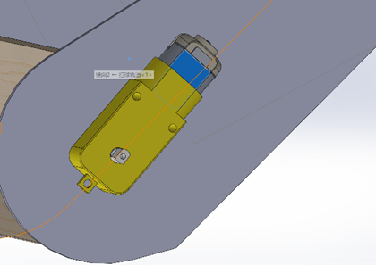
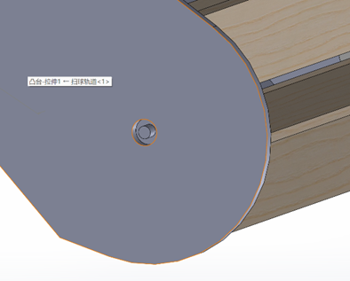
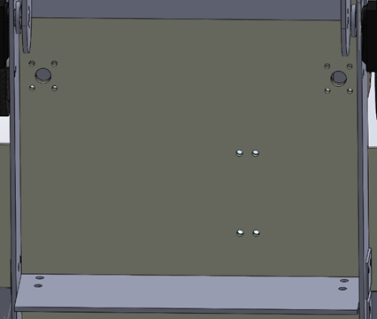
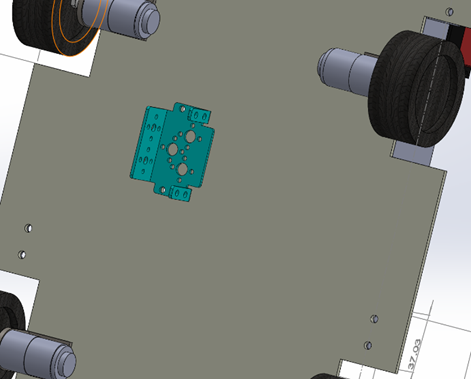

# 注释说明
### 1. 为避免螺丝对木板造成干涉，tt130电机的固定采用热熔胶固定，如下图。

### 2. 此处给轴承预留孔位，轴承外径8mm,内径4mm,厚度3mm。如下图

### 3. 储球区域后续将增加一层斜板，可避免螺丝对小球滚动的干扰

### 4. 小车底部预留舵机支架，用于控制撑杆将车撑上台阶（与范例同理），但杆的长度，触地范围等还需后期实车组装后调试得出，因此中期考核不呈现撑杆模型

