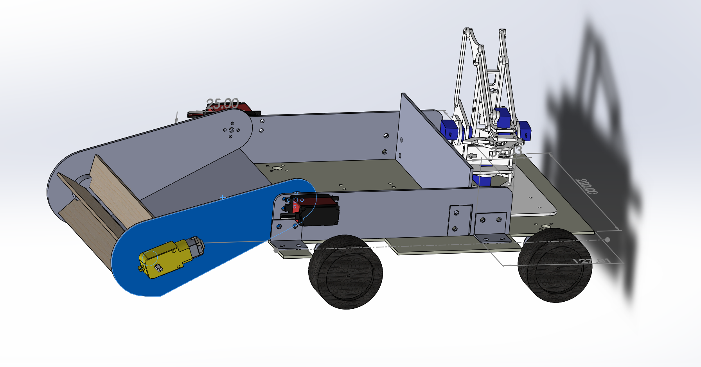
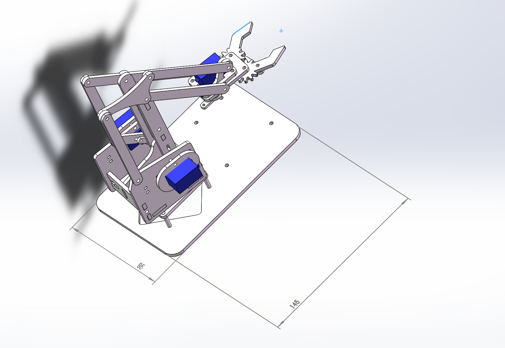

# RobotMatch

该仓库用于存放华工机器人校内赛的各种 **代码，文件，资料** 等其中，主要分为

* `ComputerVisioin` 
* `Microccontroller` 
* `MechanicalStructure` 

三个板块，其中

* `ComputerVision` 用于存放视觉识别的相关代码，模型等
* `Microcontroller` 用于存放电控的相关代码，电路板设计等资料
* `MechanicalStructure` 用于存放小车的结构，模型等

> 详细信息请阅读 [CHANGELOG](CHANGELOG.md)

## 1. ComputerVision
### 1.1 AutoAimming

用于比赛时视觉方面 **获取目标** 以及 **瞄准顺序**

### 1.2 GetDistance

用于中期考核以及瞄准用的 **距离测量**

### 1.3 GetAngle

用于瞄准的 **偏角** 计算模块

### 1.4 Calibration

用于测量相机的 **相距**

> `param.csv` 用于存放相机的各种参数

### 1.5 `Aim` 

用于更加准确地获得 **目标色块**

### 1.6 `ColorPicker`

用于获取 HSV 颜色阈值

### 1.7 `V1`

未完成品

### 1.8 `V2`

通过 `pt` 转 `onnx` 来进行识别色块，按顺序在图像中标注并计算偏角。

### 1.9 MidTermAssessment

用于提交 **中期考核** ，代码效果展示见 [Video](./ComputerVision/MidTermAssessment/medias/1.mkv)

## 2. MicroController
### 2.1 SerialControl

串口通信模块，实现在 Linux 系统下，通过 C++ 程序与 STM32 通信

### 2.2 SerialMCU

接受信息模块，将接受到的特定数据包在OLED上显示

### 2.3 SerialPWM

接受信息，并控制舵机旋转

### 2.4 RemoteController_nRF20L01

控制手柄的pcb项目

## 3. MechanicalStructure
### 3.1 零件

小车结构的零件，包括小车的 **基本框架**，**麦轮结构**，**扫球装置**，**tt130电机**

### 3.2 装配体

小车结构的装配体，包括 **局部装配体** 以及 **整车装配体**

### 3.3 Mearm机械臂

机械臂的结构，包括各 **部位零件** 及 **装配体**

